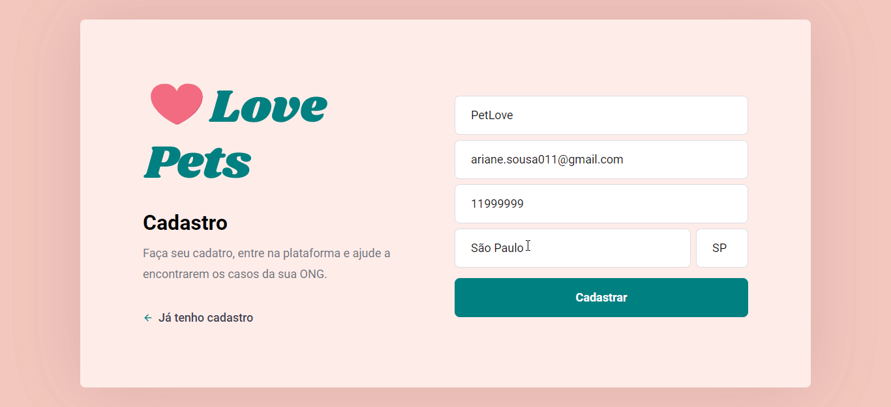

### :heart: Love Pets

### O Love Pets é uma aplicativo voltado para ONGs e pessoas que querem ajuda-lás. 

#### Na aplicação web, a ONG pode se registrar e cadastrar os incidentes, enquanto que no App desenvolvido para Mobile, as pessoas podem visualizar esses incidentes  e ajudar, entrando em contato com a ONG por meio de e-mail ou WhatsApp.

****

### Demo:




****

### :computer: Tecnologias Utilizadas:
 
- [x] React 
- [x] React router
- [x] Reactstrap
- [x] Axios
- [x] Jest
- [x] Netlify
- [x] Git
- [x] GitHub

****

:globe_with_meridians: [Link da aplicação](https://lovepets.netlify.app/)

****

## :derelict_house: Rodar o projeto localmente

****

## ⚠️ Pré-requisitos: 

- Node.js e NPM instalado

****

Passo 1: Clone o projeto na sua máquina

```sh
git clone https://github.com/ariane011/love-pets-front.git
```
Passo 2: Acesse a pasta do projeto

```sh
cd love-pets-front-end
```

Passo 3: Instale todas as dependências do projeto

```sh
npm install
```

Passo 4: Rode o projeto na sua máquina

```sh
npm start
```

Passo 5: Abra o navegador e visualize o projeto

```sh
http://localhost:3000
```
